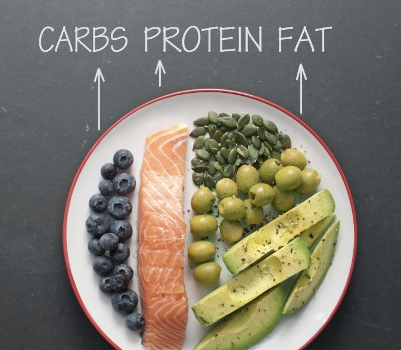
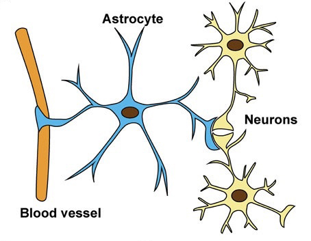

```{r setup, include=FALSE}
options(htmltools.dir.version = FALSE)
knitr::opts_chunk$set(
  fig.width=9, fig.height=3.5, fig.retina=3,
  out.width = "100%",
  cache = FALSE,
  echo = TRUE,
  message = FALSE, 
  warning = FALSE,
  hiline = TRUE
)
library(fontawesome)
library(tidyverse)
library(xaringan)
library(xaringanExtra)
library(here)
```

```{r xaringan-themer, include=FALSE, warning=FALSE}
library(xaringanthemer)

dark_yellow <- "#EFBE43"
light_yellow <- "#FDF7E9"
gray <- "#333333"
blue <- "#4466B0"

black <- "#1381B0"
orange <- "#FF961C"
white <- "#FFFFFF"

style_duo(
  primary_color = light_yellow,
  secondary_color = dark_yellow,
  inverse_header_color = white,
  header_color = gray,
  text_color = gray,
  code_inline_color = colorspace::lighten(gray),
  text_bold_color = colorspace::lighten(gray),
  link_color = blue,
  title_slide_text_color = blue,
  
  # fonts
  header_font_google = google_font("Martel", "300", "400"),
  text_font_google = google_font("Lato"),
  code_font_google = google_font("Fira Mono") 
  
)
```


```{r xaringanExtra, echo=FALSE, warning=FALSE}

library(xaringanExtra)
xaringanExtra::use_logo("slides/NORMENT_LOGO_Utekst_SORT.png",
                        width = "150px",
                        height = "150px",
                        position = xaringanExtra::css_position(top = "2em", right = "2em"))
                     


```

```{css extra.css, echo=FALSE}

.small { 
  font-size: 0.75em
}  

.bitty { 
    font-size: 1.25em;
}

.enlarge { 
    font-size: 1.5em;
}

.fade {
  opacity: 0.66;
}


```

---

class:top left
background-image: url(slides/junk_food.png)
background-position: 10% 55%
background-size:575px


## The environment

.pull-right[.enlarge[
- Diet<br><br>
- Tobacco/Cannabis<br><br>
- Alcohol<br><br>
- Medication<br><br>
- Psychosocial stress<br><br>
]]

---

class:top left
background-image: url(slides/EpiMito.png)
background-position: 10% 55%
background-size:575px

## Mitochondrial epigenetics 


.pull-right[.enlarge[
- <br><br>
- <br><br>
- <br><br>
- <br><br>
- <br><br>
]]
---

class:top left
background-image: url(slides/.png)
background-position: 10% 55%
background-size:575px

## Mitochondrial dysfunction 

.pull-right[.enlarge[
- <br><br>
- <br><br>
- <br><br>
- <br><br>
- <br><br>
]]


---

## What is the classic ketogenic diet (KD)?

.pull-left[



]

.pull-right[.enlarge[
* Ratio 4:1 <br><br>
    + fat:carbohydrate + protein <br><br>
* Fats converted to ketone bodies  <br><br>
* Ketones as alternative fuel source
]]
---

## Astrocytes also generate ketones




.footnote[A Ketogenic Diet Improve Mitochondrial Biogenesis and Bioenergetics via the PGC1ɑ-SIRT3-UCP2 Axis, Hasan-Olive ___et al___, (2019), Neurochemical Research.]
---

## Reported therapeutic effects 

.enlarge[
- Intractable epilepsy (PMID: 26222258) <br><br>
- Detox for alcohol abuse (PMID: 33837086) <br><br>
- Reduction hallucinations/delusions/social withdrawl 
]
---

## Project title: <br> Mental Health is Metabolic Health


.enlarge[**Research aims** <br> <br />

-To identify: <br>

    - Epigenetic / gene expression changes associated with the KD<br> <br> />
 
    - Mechanisms associated with symptom reduction/positive outcome

]
---
## Mental Health is Metabolic Health

.enlarge[**Clinical aims** <br> <br />

-To foster and support:<br>

    - Recovery through a low risk metabolic intervention (KD)<br> <br> />

    - Patient engagement in their own recovery
]


---

Important steps:
- Patient education about the diet
- Engaged participation of User Representatives 
- Study design / data collection 

---
class:top left
background-image: url(slides/Martens_web2022final.jpg)
background-position: 10% 55%
background-size:500px


# Acknowledgements <br>

.pull-right[
**Supervisor Stéphanie**<br><br>
**Co-Supervisor Anne-Kristin**<br><br>
**Colleagues in The Martens Group**<br><br>
**Dept. of Clinical Science II** <br><br><br>
**NORMENT** <br><br>
## &#128512; 

]

---

Metabolic problems are reversible. 
## Symptoms of metabolic disorders <br> shared with SCZ & BPD

•	Weight gain 
•	Dyslipedemia                             
•	Cardiovascular disease
•	Cognitive impairment
•	Sleep disturbances
•	Loss of quality of life  


---

---

---


---
mitochondrial changes morphological and funcitonal remodeling, abnormal cristae, decreased APT rpoduction, increased mtDNA mutations and alterations in ROS production.